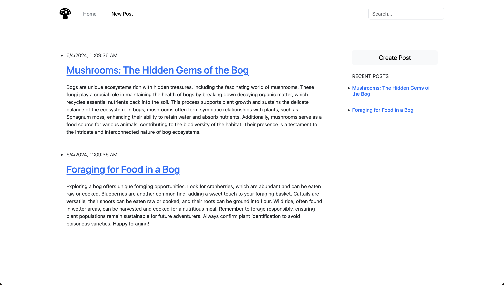

# Bog Blog

<div align="center">
    
</div>

Bog Blog is a simple web application that allows users to create and search for blog posts. The application is built using Express, EJS, and Node.js, and uses Nodemon for development.

## Table of Contents

- [Introduction](#introduction)
- [Features](#features)
- [Prerequisites](#prerequisites)
- [Installation](#installation)
- [Usage](#usage)
- [Contributing](#contributing)
- [License](#license)

## Introduction

Bog Blog is designed to help users explore and share information about foraging in bogs. Users can create blog posts, view posts, and search for specific posts using a search bar.

## Features

- Create new blog posts
- View existing blog posts
- Search for blog posts by title
- Responsive design

## Prerequisites

Before you begin, ensure you have met the following requirements:

- Node.js and npm installed
- Git installed

## Installation

To install Bog Blog, follow these steps:

1. Clone the repository:

   ```sh
   git clone https://github.com/ekdeguzm/bog-blog.git
   ```

2. Navigate to the project directory:

   ```sh
   cd bog-blog
   ```

3. Install the dependencies:
   ```sh
   npm install
   ```

## Usage

To run the project locally, follow these steps:

1. Start the server with Nodemon:

   ```sh
   npm start
   ```

2. Open your browser and go to `http://localhost:3000`.

3. Use the application to create, view, and search for blog posts.

## Project Structure

```plaintext
bog-blog/
│
├── public/
│   ├── images/
│   ├── styles/
│   └── scripts/
│
├── views/
│   ├── partials/
│   │   ├── header.ejs
│   │   └── footer.ejs
│   ├── index.ejs
│   ├── search.ejs
│   └── post.ejs
│
├── index.js
├── package.json
├── package-lock.json
└── .gitignore
```

## Contributing

Contributions are always welcome! Please follow these steps to contribute:

1. Fork the repository:

   ```sh
   git clone https://github.com/ekdeguzm/bog-blog.git
   ```

2. Create a new branch:

   ```sh
   git checkout -b feature-name
   ```

3. Install the dependencies:

   ```sh
   git commit -m 'Add some feature'

   ```

4. Push to the branch:

   ```sh
   git push origin feature-name
   ```

5. Create pull request:

## License

This is licensed under the MIT License Copyright (c) 2024.

See the [LICENSE](https://github.com/ekdeguzm/blog/blob/main/LICENSE) for information on the history of this software, terms & conditions for usage, and a DISCLAIMER OF ALL WARRANTIES.

All trademarks referenced herein are property of their respective holders.
